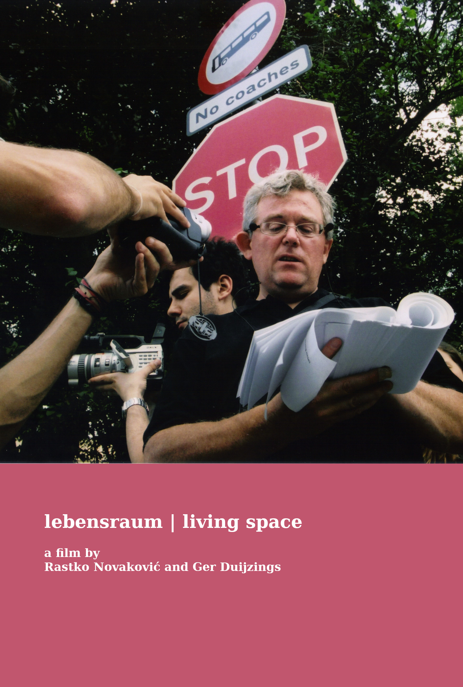

  

**lebensraum / living space** (2010/2020, 80min) 

We started with an anthropologist’s personal diary: entries made between March and August 1992 while Ger Duijzings was conducting fieldwork in Yugoslavia. We rendered them from Dutch into English and cut out most of them, keeping an entry for each day. The resulting script is an archive of people and places in dramatic form.We next made a series of negative choices. No studios. The sounds and images would be recorded in actual places and would be records of actual places. No actors. The body of the writer and eyewitness would voice the script: an archive performing an archive. No archive images. The images of the staging would act on shared images from the mass media and would be produced in tension with the script and the place of staging. No single, pure image. Instead, the effort and choices of 11 people producing moving images. The result is an event recorded in 75 minutes during the afternoon of Monday 28th July 2008. Ger Duijzings stepped out of his office at the UCL School of Slavonic and East European Studies and performed a public reading of the script whilst walking the streets of London. He wore two microphones and was followed by 7 video cameras and 2 photographic cameras. Lottie Cantle, Mark Durham, Amanda Egbe, Charles Heller, Vladimir Mitreski, Vlastimir Sudar (assisted by Cat Diehl), Paulo Tavares made video recordings. Aubrey Wanliss-Orlebar and Rastko Novaković took photographs. Mark Durham was in charge of the sound design and recording. The collected material was edited by Mark Durham, Owen Saward and Rastko Novaković.

The project has evolved as a series of artworks dealing with ‘living space‘. Through case studies of specific places and historical events, the art process is used as an intervention. A dynamic relationship is established between the spaces of: 1) research (archive work, explorations of space), 2) staging (performance, re-enactment) and 3) presentation (screening, exhibition, discussion).

You are welcome to [download](http://www.archive.org/details/LebensraumLivingSpace) a screener. In addition, you can [read](https://rosedetivoli.github.io/images/lebensraum-essay2.pdf) an extended essay on the working process and inspirations as well as a [discussion](https://rosedetivoli.github.io/lse/) held at the Cities Programme at LSE (London). Since then we have re-presented the script in a different staging as a performance **kentish town lebensraum** (2009) – you can [read about it or watch a video of the performance](https://rosedetivoli.github.io/ktlebensraum/). lebensraum has also been presented as a sound piece at Vienna’s Kunsthalle Exnergasse (2010) as part of the show [‘Bless my Homeland Forever‘](https://www.wuk.at/kunsthalle-exnergasse/kunsthalle-exnergasse-archiv/2010/09/bless-my-homeland-forever/). A new essay written by Ger and Rastko is included in the ['Engaged Urbanism'](https://www.bloomsbury.com/uk/engaged-urbanism-9781784534592/) book, published by IB Tauris in 2016.  
